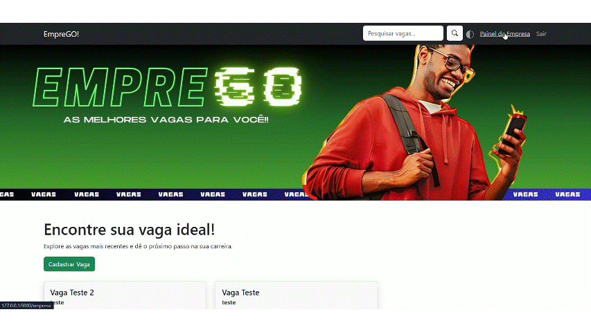

# EmpreGO! - Conectando Talentos a Oportunidades

O EmpreGO! é uma plataforma web que visa conectar candidatos a empresas que oferecem vagas de emprego. O projeto facilita a busca por emprego, permitindo que os candidatos encontrem vagas relevantes e se candidatem de forma rápida e eficiente, enquanto as empresas podem anunciar suas vagas e gerenciar os candidatos de maneira organizada.

## Funcionalidades

**Para Candidatos:**

* **Busca de Vagas:** Os candidatos podem pesquisar vagas por palavra-chave, empresa, tipo de contrato (CLT, PJ) e formato de trabalho (presencial, remoto, híbrido).
* **Visualização de Detalhes da Vaga:** Acesso a informações detalhadas sobre a vaga, como descrição, requisitos, salário e informações sobre a empresa.
* **Candidatura Simplificada:** Envio de currículo e informações de contato diretamente pela plataforma.


**Para Empresas:**

* **Cadastro de Vagas:** Criação de anúncios de vagas com informações relevantes, como título, descrição, requisitos, tipo de contrato, formato de trabalho, salário e local.
* **Gerenciamento de Vagas:** Edição e exclusão de vagas, além de controle do status da vaga (ativa/inativa).
* **Acesso aos Currículos dos Candidatos:** Visualização dos currículos dos candidatos que se candidataram às vagas da empresa.
* **Download de Currículos:** Download dos currículos dos candidatos em formato PDF.



**Para Administradores:**
* **Gerenciamento de Empresas:** Cadastro, edição, exclusão e controle do status das empresas cadastradas na plataforma.
* **Acesso Total à Plataforma:** Visão geral das vagas, empresas e candidatos.
 

 
## Tecnologias Utilizadas

* **Backend:** Python com Flask
* **Banco de Dados:** MySQL
* **Frontend:** HTML, CSS, JavaScript e Bootstrap

## Como Executar o Projeto

1. **Clone o Repositório:** `git clone https://github.com/seu-usuario/Projeto-EmpreGo.git`
2. **Crie o Banco de Dados:** Execute o script `scriptBD.sql` no seu servidor MySQL para criar o banco de dados e as tabelas necessárias.
3. **Configure as Credenciais do Banco de Dados:**  Edite o arquivo `config.py` com as suas credenciais do MySQL.
4. **Instale as Dependências:** `pip install -r requirements.txt`
5. **Execute o Aplicativo:** `python app.py`

## Estrutura do Projeto

```
EmpreGO/
├── app.py          # Arquivo principal do aplicativo Flask
├── db_functions.py # Funções para interação com o banco de dados
├── config.py       # Configurações do projeto
├── scriptBD.sql   # Script para criação do banco de dados
├── static/         # Arquivos estáticos (CSS, JS, imagens)
│   ├── style.css
│   └── ...
├── templates/      # Arquivos de template HTML
│   ├── index.html
│   ├── empresa.html
│   ├── login.html
│   ├── ...
└── uploads          # Pasta para upload de currículos
    └── ...

```


## Próximos Passos

* Implementar um sistema de autenticação mais robusto.
* Adicionar recursos de filtragem e ordenação avançados para as vagas.
* Desenvolver uma interface mais responsiva e intuitiva.
* Implementar testes automatizados.

## Contribuições

Contribuições são bem-vindas! Sinta-se à vontade para abrir issues e pull requests.


## Licença

[MIT](https://choosealicense.com/licenses/mit/)


## Contato

[Pedro Vitor Ribeiro Silva] - [pedrovitorrbeirosilva@gmail.com]


---


Este arquivo README.md fornece uma visão geral do projeto EmpreGO!, incluindo suas funcionalidades, tecnologias utilizadas, instruções de execução, estrutura do projeto, próximos passos e informações de contato. Ele foi escrito usando linguagem Markdown para facilitar a leitura e formatação no GitHub ou em outras plataformas que suportam Markdown.
